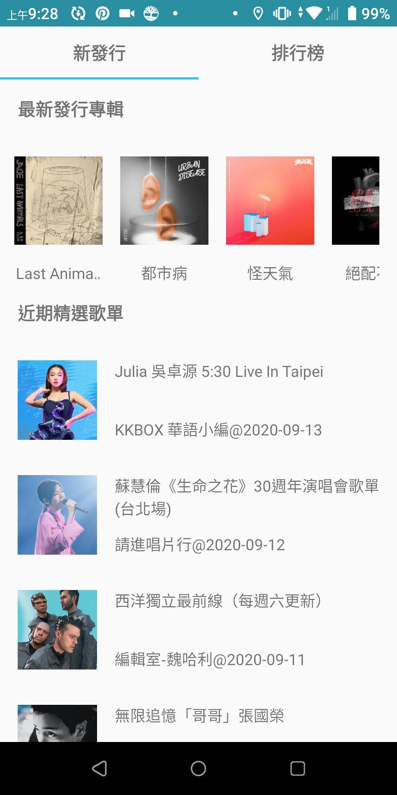

# JK Boites

This is a repo using MVVM structure for an assignment to display newest release albums, featured playlists, chart,
the playlist of each item, the tracks of each playlist, and a webview for each track.

## Home page

 

 

## New release paging

 

## playlist page

 

 

## track page

 

## Framework & Tools

- Android development using
  - Kotlin
  - MVVM structure
  - Coroutines
  - Unit Test
  - Lifecycle
  - Navigation
  - ViewPager 2
  - Paging 3
  - Data binding

- Networking by
  - KKBOX open API
  - Retrofit2 & Moshi
  - Glide

- Tools
  - Git & GitHub

## IDE

**Android Studio** - 3.6.2

**Android SDK** - 23+

**Gradle** - 3.6.2
